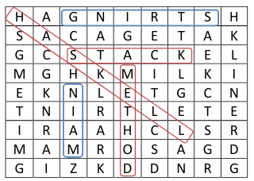
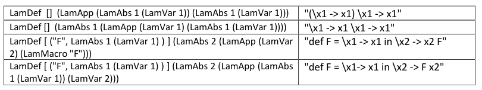
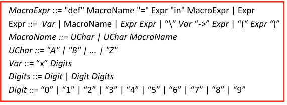
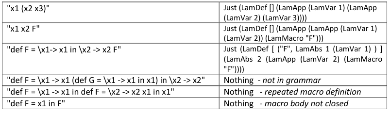
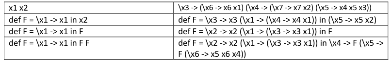
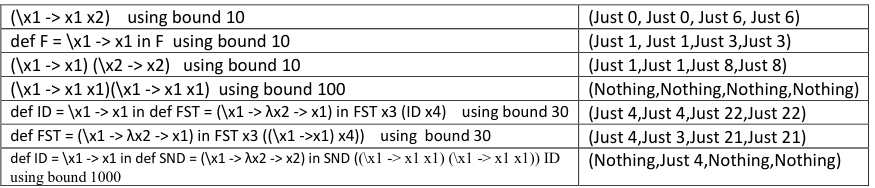

# University of Southampton Haskell Coursework Challenges

Solutions for a set of 6 challenges, defined for a second year Haskell Coursework.

## Challenges Description

### Challenge 1

- Function that takes an `N x N` non-empty square grid of characters and a set of words to search for and returns a list of placements of the given strings within the grid, provided such a placement exists
  - If there is no such placement, then `Nothing` for a placement will be returned
- Signature: `solveWordSearch :: [String] -> WordSearchGrid -> [(String, Maybe Placement)]`
- Words are assumed to not to appear more than once in the puzzle grid
- Solution for the grid below:

```haskell
[("HASKELL",Just((0,0),DownForward)),
("STRING",Just((7,0),Back)),
("STACK",Just((2,2),Forward)),
("MAIN",Just((2,7),Up)),
("METHOD",Just((4,3),Down))]
```



### Challenge 2

- Function that, given a list of words and a value representing the maximum density of the puzzle, returns a grid of characters in which all of the given words are hidden exactly once
  - Density value is between 0 and 1
- Palindrome inputs are not considered
- Signature: `createWordSearch :: [ String ] -> Double -> IO WordSearchGrid`

### Challenge 3

- Pretty printer for the Lambda expressions with macros

  - Un-parses a lambda expression with macros to a string
  - Uses the exact number of brackets required
  - Recognises sub-expressions that are syntactically equal to those defined in a macro
    - If 2 overlap, the larger one of the 2 is used
  - If two same macros are defined, the one defined first will be used

- Delimiters:

  - `\` for starting abstraction
  - '->' for delimiting the body within an abstraction

- Function signature: `prettyPrint :: LamMacroExpr -> String `
- Examples:
  

#### Data Constructor of the Lambda Language (with Macros)

```haskell
data LamMacroExpr = LamDef [(String, LamExpr)] LamExpr
  deriving (Eq, Show, Read)
data LamExpr = LamMacro String | LamApp LamExpr LamExpr  |
               LamAbs Int LamExpr  | LamVar Int deriving (Eq,Show,Read)
```

### Challenge 4

- Parser for a lambda expression with macros using the concrete syntax shown below:
  
- Uses the monadic parser principles published by [Hutton and Meijer](http://www.cs.nott.ac.uk/~pszgmh/pearl.pdf)
- Function signature: `parseLamMacro :: String -> Maybe LamMacroExp`
- Return `Nothing` when the string isn't parsed correctly according to the rules of grammar
- Properties enforced:

  1. Macros are uniquely defined within a term (aka. macros names are unique)
  2. Macros are defined only with closed terms (mustn't have any free variables)

- Examples:
  

### Challenge 5

- Check the [basics of Continuation-Passing Style](https://en.wikipedia.org/wiki/Continuation-passing_style) before having a look at this challenge
- Function translates a lambda expression in to one in cps according to the transition rules
  - Also ensures to avoid capturing any free variables in the abstractions
- Function signature: `cpsTransform :: LamMacroExpr -> LamMacroExpr`
- Example:
  

### Challenge 6

- Functions perform reductions on lambda expressions with macros using both innermost and outermost reduction strategies (both are leftmost, however)
- Signatures of reductions functions:
  - `innerRedn1:: LamMacroExpr -> Maybe LamMacroExpr`
  - `outerRedn1:: LamMacroExpr -> Maybe LamMacroExpr`
- Using these functions, another function outputs a tuple containing the number of reductions required to fully reduce an expression using both strategies on both normal expressions and cps transformed ones
  - It also takes a bound and returns `Nothing` in case the number of reductions gets bigger than the provided bound
  - To be more exact 4-tuple contains:
    1. Innermost reduction on Expression
    2. Outermost reduction on Expression
    3. Innermost reduction on the CPS translation of expression applied to the identity function
    4. Outermost reduction on the CPS translation of E applied to the identity function
- Signature for comparison function: `compareInnerOuter :: LamMacroExpr -> Int -> ( Maybe Int, Maybe Int, Maybe Int, Maybe Int)`
- Examples:
  

## Production

- Make sure to have `ghc` `cabal` and `stack` installed
- `Stack build` to build an executable image
- `Stack exec challenges-exe` to execute an image

## Development

### Tree

- The outline of the project is the default `stack` project
  ```
  .
  ├── app
  │   └── Main.hs
  ├── challenges.cabal
  ├── ChangeLog.md
  ├── dist-newstyle
  │   ├── cache
  │   │   ├── compiler
  │   │   ├── config
  │   │   ├── elaborated-plan
  │   │   ├── improved-plan
  │   │   ├── plan.json
  │   │   ├── solver-plan
  │   │   └── source-hashes
  │   └── sdist
  │       └── challenges-0.1.0.0.tar.gz
  ├── hie.yaml
  ├── images
  │   ├── ch1.png
  │   ├── ch3Ex.png
  │   ├── ch4Ex.png
  │   ├── ch4.png
  │   ├── ch5Ex.png
  │   └── ch6Ex.png
  ├── LICENSE
  ├── package.yaml
  ├── README.md
  ├── Setup.hs
  ├── src
  │   ├── Lib.hs
  │   └── Parsing.hs
  ├── stack.yaml
  ├── stack.yaml.lock
  └── test
      └── Spec.hs
  ```

### Testing

- Uses `Hunit` and `QuickTest` framework
- Make sure to read through those to get a better understanding of what the functions are capable of doing
- `stack test` to run the tests
